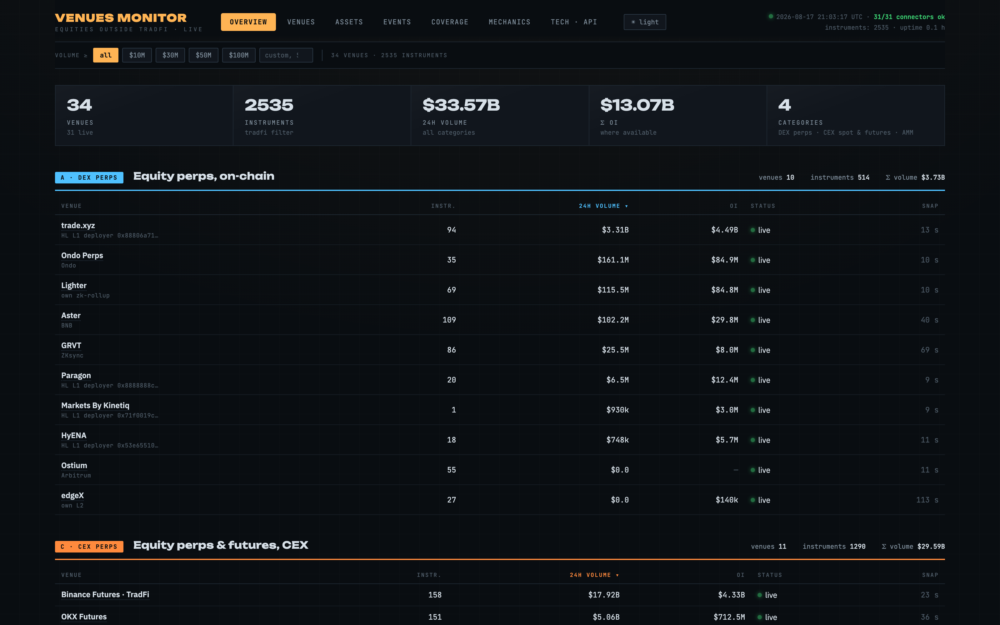
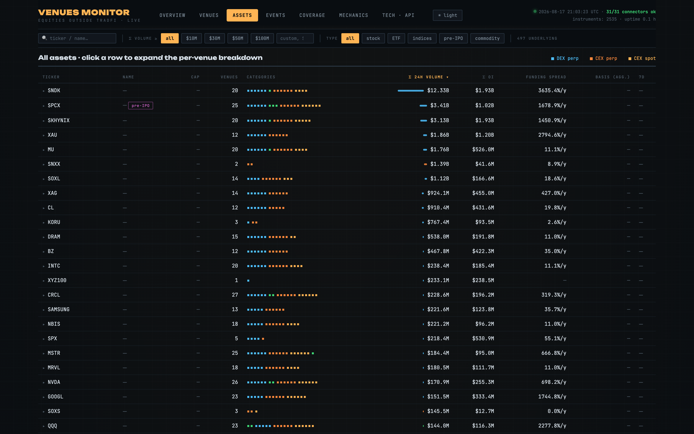
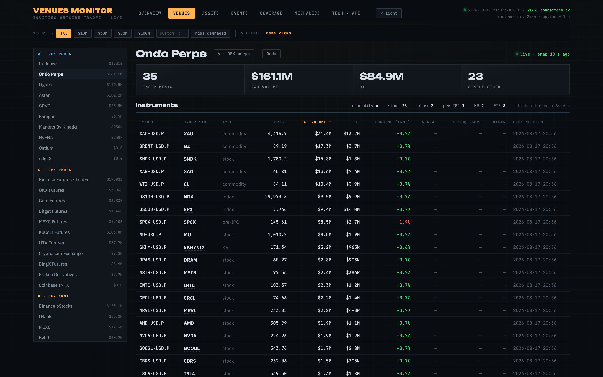

# Venues Monitor

Live dashboard of every venue where US equities trade **outside traditional markets**:
tokenized stocks (spot), stock perpetuals on DEXes and CEXes, index/commodity contracts,
and pre-IPO instruments — all on crypto rails.



## Why this exists

US equities have been migrating onto crypto rails fast. As of August 2026 the tokenized-stock
market cap is ~$2.3B ([RWA.xyz](https://app.rwa.xyz/stocks)), stock-perp open interest is
~$8.3B (up ~90x YTD), and stock-linked perps trade ~$20B/day. The venue landscape churns
weekly — new HIP-3 deployers appear, issuers launch, venues die (Ventuals, Felix and
Dreamcash all shut down within one month of each other). Public data about this market is
scattered across 30+ incompatible APIs and nobody records its liquidity history.

This service is a single live registry: which venues are alive, what trades where, what the
liquidity actually looks like (order-book depth, not just self-reported volume), and how much
of the US market is covered.

## What it does

- Polls **30+ public venue APIs** every 60–90 s: price, 24h volume, open interest, funding,
  top-of-book spread; hourly order-book depth at ±10/25/50 bps; basis vs the last NYSE close.
- **Auto-discovers listings and delistings** — new Hyperliquid HIP-3 deployers, new Binance
  contracts, new xStocks pairs show up on the dashboard without code changes, and every
  listing/delisting becomes a timestamped event.
- **Normalizes symbols across venues**: TSLA on trade.xyz = TSLAX on Bybit = TSLAB on
  Binance = TSLASTOCK_USDT on MEXC = PF_TSLAXUSD on Kraken — one underlying, with guards
  against crypto-ticker collisions.
- **Records history**: DuckDB + hourly parquet partitions. For several venues (Lighter,
  Ostium, the HIP-3 long tail) nobody else records this data and it cannot be bought later.
- **Coverage view**: joins live instruments against the full US ticker catalog — which part
  of the US market is tradeable on crypto rails, by market-cap bucket, and what is likely
  to list next.

Typical live state: **~30 venues · ~2,400 instruments · ~500 unique underlyings** across
five categories: DEX perps (A), CEX spot tokenized stocks (B), CEX equity futures (C),
pre-IPO (D), on-chain AMM spot (E).

## Screens

| | |
|---|---|
|  |  |

7 tabs: Overview (categories A–E with volume filters) · Venues · Assets (per-underlying
aggregation with venue breakdown) · Events (listings/delistings feed) · Coverage ·
Mechanics (how each instrument type actually works) · Tech (per-connector methodology).

## Run

```bash
docker compose up --build
# → http://localhost:8090
```

or without Docker:

```bash
cd service
python3 -m venv .venv && .venv/bin/pip install -r requirements.txt
.venv/bin/uvicorn app.api:app --port 8090
```

No API keys required. One optional key unlocks extras (see `.env.example`):
`MASSIVE_API_KEY` (Massive, ex-Polygon) enables basis vs NYSE close, the price
validator and the Coverage tab.

Data accumulates from first start under `service/data/` (override with `VM_DATA`).

## How it works

Single Python process: FastAPI + asyncio pollers, DuckDB + parquet storage, vanilla-JS
frontend. Per-domain rate limiting, 429 backoff, price-sanity quarantine, delisting
flap guards. Details: [docs/ARCHITECTURE.md](docs/ARCHITECTURE.md), and the dashboard's
**Tech** tab documents every connector's discovery filter and the metric methodology.

Notable connector tricks:

- Kraken lists xStocks pairs **only** over WebSocket v2 with `include_tokenized_assets: true` —
  they are invisible in the default REST listing.
- Hyperliquid HIP-3 deployers are discovered through `perpDexs`, so new stock-perp DEXes
  (trade.xyz, HyENA, Markets by Kinetiq, Paragon…) appear automatically.
- Binance's TradFi section is one filter: `underlyingType ∈ {EQUITY, KR_EQUITY, PREMARKET,
  COMMODITY, INDEX}` — currently the largest single stock-perp venue.
- Ondo Perps (launched July 2026) exposes clean public REST: mark prices, volume, OI,
  per-market funding.

## Known limitations

- CEX 24h volumes are **self-reported** and wash trading is not filtered out; order-book
  depth is the primary liquidity metric here.
- Vest Markets and Extended sit behind Cloudflare bot protection and are not polled;
  ApeX Omni's API stopped resolving in August 2026 and was removed.
- Basis is measured against the last NYSE close, not live NBBO.
- History starts when you start the service — venue APIs expose current state only.

## Watchlist

Not yet pollable, checked manually: OKX×ICE tokenized NYSE equities (JV announced June 2026,
H2 target) · Coinbase tokenized stocks on Base (staged rollout) · Nasdaq/DTC tokenized
trading (SEC-approved, H2) · Arcus on Robinhood Chain (spot live, perps waitlisted, no
public API found) · KuCoin xStocks (on-chain "Alpha" product, absent from the spot API) ·
Robinhood Chain stock tokens (EVM RPC only).

## License

MIT
